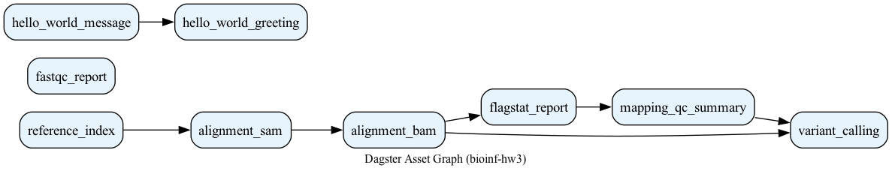

# Домашнее задание 3 — Пайплайн оценки качества картирования

---

## Вариант 7

| Параметр | Значение |
|----------|----------|
| Платформа секвенирования | Oxford Nanopore (MinION / GridION / PromethION) |
| Инструмент картирования | [minimap2](https://github.com/lh3/minimap2) |
| Фреймворк пайплайнов | [Dagster](https://dagster.io/) |

---

## Использованные данные

| Тип | Идентификатор | Описание | Ссылка |
|-----|---------------|----------|--------|
| Риды | **SRR39004285** | ONT whole-genome sequencing, *Escherichia coli*, GridION (~160 Mb) | https://trace.ncbi.nlm.nih.gov/Traces/?run=SRR39004285 |
| Референс | **GCF_000005845.2** | *E. coli* K-12 substr. MG1655 | https://www.ncbi.nlm.nih.gov/assembly/GCF_000005845.2/ |

Локальные пути после `./scripts/download_data.sh`:
- `data/reads/SRR39004285.fastq`
- `data/reference/GCF_000005845.2_ASM584v2_genomic.fna`

---

## Результаты оценки качества картирования

Пайплайн был запущен на реальных данных **SRR39004285** двумя способами: bash-скрипт и Dagster-пайплайн. Оба дали **одинаковый** результат.

### Итоговая оценка

| Метрика | Значение |
|---------|----------|
| Образец | SRR39004285 |
| Инструмент картирования | minimap2 `-ax map-ont` |
| Всего ридов | 42 242 |
| Primary ридов | 34 992 |
| Secondary | 5 336 |
| Supplementary | 1 914 |
| **Картировано (mapped)** | **37 859 (89.62%)** |
| Primary mapped | 30 609 (87.47%) |
| Порог качества | 90% |
| **Вердикт** | **not OK** |

**Интерпретация:** доля картированных ридов (89.62%) **ниже порога 90%**, поэтому алгоритм выводит `not OK` и **не выполняет** дальнейшие шаги — `samtools sort` и коллинг вариантов через `freebayes`. Это соответствует блок-схеме из задания.

### Полный вывод `samtools flagstat`

```
42242 + 0 in total (QC-passed reads + QC-failed reads)
34992 + 0 primary
5336 + 0 secondary
1914 + 0 supplementary
0 + 0 duplicates
0 + 0 primary duplicates
37859 + 0 mapped (89.62% : N/A)
30609 + 0 primary mapped (87.47% : N/A)
0 + 0 paired in sequencing
0 + 0 read1
0 + 0 read2
0 + 0 properly paired (N/A : N/A)
0 + 0 with itself and mate mapped
0 + 0 singletons (N/A : N/A)
0 + 0 with mate mapped to a different chr
0 + 0 with mate mapped to a different chr (mapQ>=5)
```

Файлы: `results/bash_pipeline/SRR39004285.flagstat.txt`, `results/dagster_pipeline/SRR39004285.flagstat.txt`

### Вывод скрипта разбора flagstat

Команда:
```bash
python3 scripts/parse_flagstat.py results/bash_pipeline/SRR39004285.flagstat.txt
```

Результат:
```
Mapped reads: 89.62%
Threshold: 90.00%
not OK
```

### QC-отчёты

| Реализация | Файл отчёта | Статус |
|------------|-------------|--------|
| Bash | `results/bash_pipeline/SRR39004285_qc_report.txt` | not OK |
| Dagster | `results/dagster_pipeline/SRR39004285_qc_summary.txt` | not OK |

FastQC-отчёты:
- `results/bash_pipeline/fastqc/SRR39004285_fastqc.html`
- `results/dagster_pipeline/fastqc/SRR39004285_fastqc.html`

---

## Результаты Dagster Hello World

Тестовый пайплайн успешно выполнен (`RUN_SUCCESS`).

| Asset | Результат |
|-------|-----------|
| `hello_world_message` | `Hello, Dagster! Bioinformatics pipeline is ready.` |
| `hello_world_greeting` | `Hello, Dagster! Bioinformatics pipeline is ready. Framework: Dagster. Mapper: minimap2. Platform: ONT.` |

Подробнее: `results/dagster_pipeline/hello_world_result.txt`  
Лог: `logs/dagster_hello_world.log`

---

## Визуализация пайплайна

Граф зависимостей assets (DAG) экспортирован автоматически:



Структура DAG:
```
fastqc_report                          (независимая ветка)
reference_index → alignment_sam → alignment_bam → flagstat_report → mapping_qc_summary → variant_calling
hello_world_message → hello_world_greeting
```

Описание способа визуализации и отличий от блок-схемы алгоритма: [docs/visualization_description.md](docs/visualization_description.md)

---

## Структура репозитория

```
bioinf/
├── scripts/
│   ├── download_data.sh              # Скачивание SRA и референса
│   ├── mapping_qc.sh                 # Bash-алгоритм оценки качества
│   ├── parse_flagstat.py             # Парсер samtools flagstat → %mapped, OK/not OK
│   └── generate_dag_visualization.py # Экспорт DAG в PNG
├── dagster_project/
│   ├── hello_world.py                # Тестовый пайплайн Dagster
│   ├── mapping_qc_pipeline.py        # Пайплайн оценки картирования на Dagster
│   └── definitions.py                # Точка входа для dagster dev / materialize
├── docs/
│   ├── dagster_install.md            # Инструкция по установке Dagster
│   └── visualization_description.md  # Описание визуализации DAG
├── results/
│   ├── bash_pipeline/                # Результаты bash-скрипта
│   └── dagster_pipeline/             # Результаты Dagster + asset_dag.png
└── logs/                             # Лог-файлы выполнения
```

---

## Соответствие требованиям задания

| # | Требование | Где лежит |
|---|-----------|-----------|
| 1 | Ссылка на риды из NCBI SRA | Таблица «Использованные данные» выше |
| 2 | Bash-скрипт с алгоритмом | `scripts/mapping_qc.sh` |
| 3 | Результат `samtools flagstat` | `results/bash_pipeline/SRR39004285.flagstat.txt` |
| 4 | Скрипт разбора flagstat | `scripts/parse_flagstat.py` |
| 6 | Инструкция по установке фреймворка | `docs/dagster_install.md` |
| 7 | Hello World на Dagster | `dagster_project/hello_world.py` |
| 8 | Результаты и логи Hello World | `results/dagster_pipeline/hello_world_result.txt`, `logs/dagster_hello_world.log` |
| 10 | Пайплайн оценки качества на Dagster | `dagster_project/mapping_qc_pipeline.py` |
| 11 | Результаты работы пайплайна | `results/dagster_pipeline/pipeline_results.txt`, раздел «Результаты оценки» выше |
| 12 | Лог-файлы пайплайна | `logs/bash_pipeline.log`, `logs/dagster_mapping_qc.log` |
| 13 | Визуализация пайплайна (графический файл) | `results/dagster_pipeline/asset_dag.png` |
| 14 | Описание визуализации и отличий от блок-схемы | `docs/visualization_description.md` |

---

## Алгоритм (блок-схема → реализация)

```
FASTQ
  │
  ├─→ FastQC (контроль качества, сохранение отчёта)
  │
  └─→ minimap2 -ax map-ont (картирование ONT-ридов)
        └─→ samtools view (SAM → BAM)
              └─→ samtools flagstat
                    └─→ parse_flagstat (% mapped)
                          │
                          ├─→ > 90%  →  OK  →  samtools sort → freebayes → VCF → Finished
                          └─→ ≤ 90%  →  not OK  →  стоп (без sort/freebayes)
```

- **Bash:** `scripts/mapping_qc.sh`
- **Dagster:** assets в `dagster_project/mapping_qc_pipeline.py`

---

## Как воспроизвести

```bash
# 1. Python-окружение и Dagster
python3 -m venv .venv && source .venv/bin/activate
pip install -e .

# 2. Биоинформатические инструменты (macOS)
brew install minimap2 samtools fastqc freebayes sratoolkit graphviz

# 3. Скачивание данных
chmod +x scripts/*.sh
./scripts/download_data.sh

# 4. Bash-алгоритм
./scripts/mapping_qc.sh

# 5. Dagster Hello World
dagster asset materialize -m dagster_project.definitions \
  --select hello_world_message,hello_world_greeting

# 6. Dagster mapping QC pipeline
dagster asset materialize -m dagster_project.definitions \
  --select 'fastqc_report,reference_index,alignment_sam,alignment_bam,flagstat_report,mapping_qc_summary,variant_calling'

# 7. Экспорт DAG в PNG
python scripts/generate_dag_visualization.py

# 8. (опционально) Dagster UI
dagster dev -m dagster_project.definitions
# → http://127.0.0.1:3000
```

Подробная инструкция по установке: [docs/dagster_install.md](docs/dagster_install.md)
